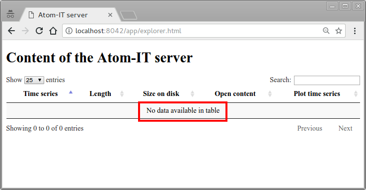
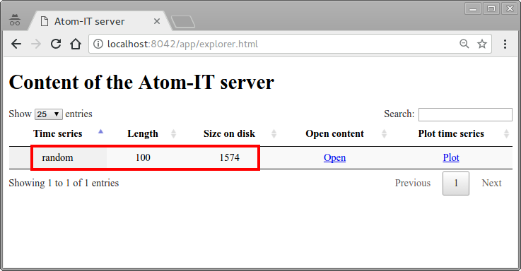
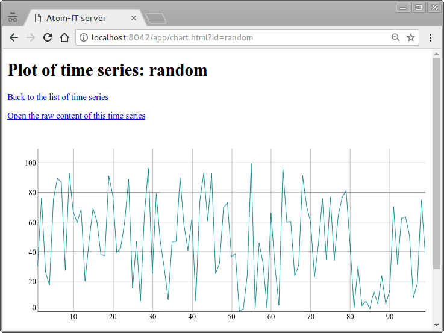
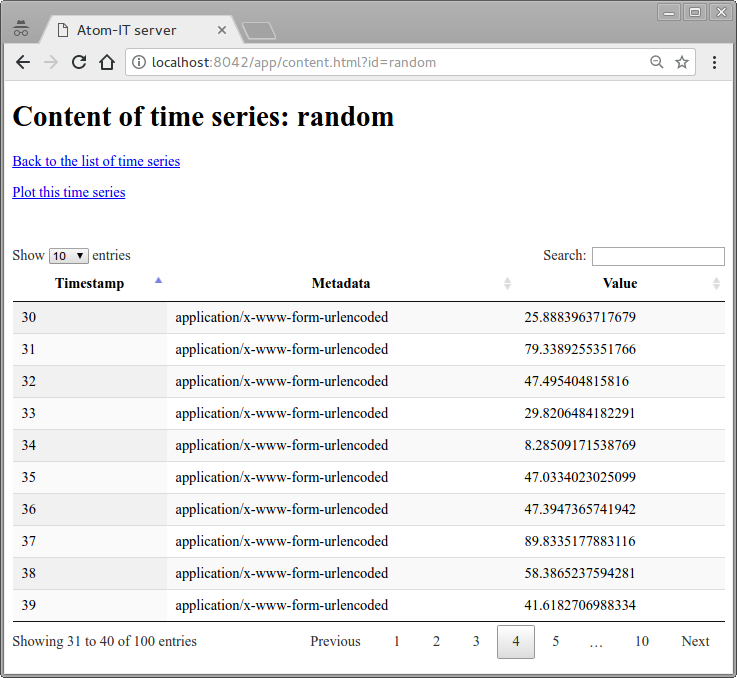

Quick start
===========

This page provides a quick start to the Atom-IT server by explaining
how to create a random time series, then display it using the built-in
Web interface. The sample assumes that we run a UNIX-like environment
(such as GNU/Linux).

### Start the server

Firstly, start the Atom-IT server thanks to the [official Docker
images](Compilation.md#docker):

```
$ sudo docker run -p 8042:8042 --rm jodogne/atomit
W1222 09:26:57.641798 main.cpp:385] Atom-IT version: mainline (20171218T140044)
W1222 09:26:57.641843 ConfigurationSection.cpp:146] Loading configuration from: "/etc/atomit/atomit.json"
W1222 09:26:57.641930 MainTimeSeriesFactory.cpp:289] Enabling auto-creation of time series:
                      Memory backend with unlimited length, unlimited size, and sequential timestamps
W1222 09:26:57.641945 ServerContext.cpp:207] Starting the filters
W1222 09:26:57.641954 main.cpp:197] The Atom-IT server has started
W1222 09:26:57.642624 main.cpp:153] HTTP server listening on port: 8042
```

### Open the Web interface

As can be seen at the last line of the Docker log, the Web interface
is now up and running on port 8042. As a consequence, as a second
step, open http://localhost:8042/ using your favorite Web browser.

Credentials will be asked, use `atomit` as username and `atomit` as
password. The Web interface indicates that there is no [time
series](Concepts.md#time-series) currently stored by the Atom-IT
server:




### Create a time series with random numbers

Let's create a time series called `random`, and fill it with random
data. To this end, here is a one-liner command-line that generates 1
floating-point number in the [0..100] range using
[Perl](https://en.wikipedia.org/wiki/Perl), then uploads this number
through the [REST API](RestApi.md) of the Atom-IT server using the
standard [cURL](https://en.wikipedia.org/wiki/CURL) command-line tool:

```
$ perl -le 'print rand(100)' | \
  curl -X POST -u atomit:atomit http://localhost:8042/series/random -d @-
```

A few explanations:

 * Perl prints the random number on the [standard output](https://en.wikipedia.org/wiki/Standard_streams), i.e. `stdout`.
 * cURL reads this number from its standard input through the [pipe](https://en.wikipedia.org/wiki/Pipeline_(Unix)), and uses it as the body of the HTTP request (this is the purpose of `-d @-`.
 * The `http://localhost:8042/series/random` URI corresponds to the
   location of the time series called `random` in the [REST API](RestApi.md)
   of the Atom-IT server.
 * The `-X POST` argument makes explicit that a HTTP POST request is used.
 * The `-u atomit:atomit` provides the default credentials for the Docker image.

The Atom-IT server returns a value of `{}`, which indicates success.

Thanks to the [`xargs` standard command-line
tool](https://en.wikipedia.org/wiki/Xargs), it is possible to store
several random numbers to the time series in just one command
line. Let's add 99 random numbers to the end of the time series:

```
$ perl -le 'print rand(100) for(1..99)' | \
  xargs -n1 curl -X POST -u atomit:atomit http://localhost:8042/series/random -d
```


### Plot the time series

If refreshing the Web interface, it can be seen that the time series
called `random` is now available in the list of time series:



The time series contains 100 messages, whose total size is 1574 bytes.
By clicking on the `Plot` link, the Atom-IT server proposes a basic chart
rendering of the content of this time series:



Note that this plotting feature is only available if the value of the
messages in the time series can be interpreted as numbers by
JavaScript. More advanced rendering interfaces can be built upon the
REST API of the Atom-IT server.

Going back to the list of time series, it is possible to inspect the
raw content of the time series by clicking on the `Open` link:



In this screen, the "timestamp", "metadata", and "value"
[concepts](Concepts.md#time-series) are clearly indicated.  The
timestamp is auto-generated as a sequence of increasing numbers, which
corresponds to the [default timestamp
policy](Configuration.md#timestamps-policy).  As we have been using the
REST API to store items, the metadata is set to the [HTTP
Content-Type](https://developer.mozilla.org/en-US/docs/Web/HTTP/Headers/Content-Type)
of the request, that defaults to `application/x-www-form-urlencoded`
if using cURL.

This concludes our basic example for using the Atom-IT server.  You
can now explore the [configuration options](Configuration.md) as well
as the [available samples of IoT workflow](../README.md#documentation).
