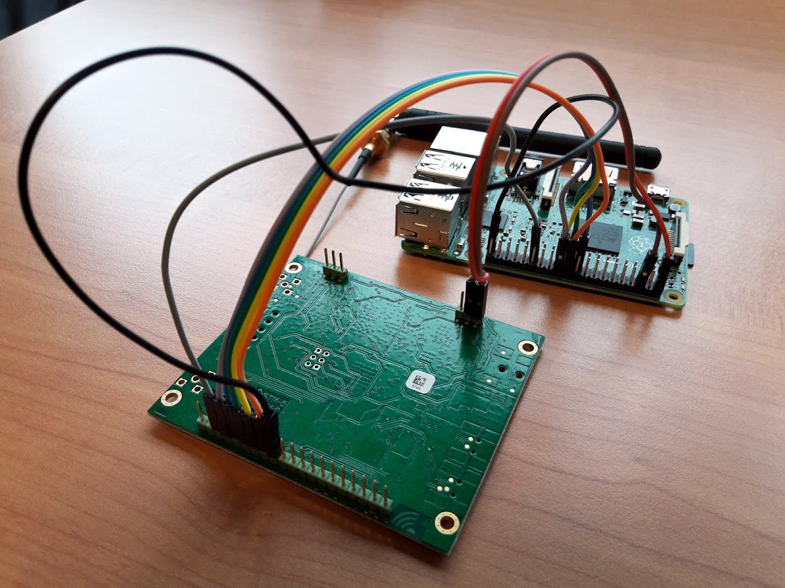

Standalone LoRa gateway
=======================

The Atom-IT server can be used to easily setup a standalone LoRa
gateway, which is useful to deploy a private LoRa network.


Hardware
--------

The required hardware is described in a
[story](https://www.thethingsnetwork.org/labs/story/setting-up-a-mobile-gateway)
on The Things Network Labs. It consists in combining a [IMST iC880a
concentrator](https://wireless-solutions.de/products/radiomodules/ic880a.html)
with a [Raspberry Pi](https://en.wikipedia.org/wiki/Raspberry_Pi):




Software configuration
----------------------

Firstly, [compile](Compilation.md) the Atom-IT server for the
Raspberry Pi.

Secondly, let's create a script that is used to reset the IMST iC880a
concentrator:

```
$ cat << EOF > ./reset-ic880a.sh
#!/bin/bash
# Reset iC880a PIN
SX1301_RESET_BCM_PIN=25
echo "\$SX1301_RESET_BCM_PIN"  > /sys/class/gpio/export 
echo "out" > /sys/class/gpio/gpio\$SX1301_RESET_BCM_PIN/direction 
echo "0"   > /sys/class/gpio/gpio\$SX1301_RESET_BCM_PIN/value 
sleep 0.1  
echo "1"   > /sys/class/gpio/gpio\$SX1301_RESET_BCM_PIN/value 
sleep 0.1  
echo "0"   > /sys/class/gpio/gpio\$SX1301_RESET_BCM_PIN/value
sleep 0.1
echo "\$SX1301_RESET_BCM_PIN"  > /sys/class/gpio/unexport 
EOF
```


Capturing the LoRa packets
--------------------------

Here is a sample [configuration file](Configuration.md) that will
capture all the LoRa packets received by the IMST iC880a, and then
stores them as a CSV file:

```
$ cat << EOF > ./Configuration.json
{
  "AutoTimeSeries": { },
  "Filters" : [
    {
      "Type": "IMST",
      "Output" : "lora"
    },
    {
      "Type": "CSVSink",
      "Path": "lora.csv",
      "Input" : "lora"
    }
  ]
}
EOF
```

This sample only uses the [IMST](Filters.md#imst) and
[CSVSink](Filters.md#csvsink) filter. Before starting the Atom-IT
server, the concentrator must first be reset:

```
$ sudo bash ./reset-ic880a.sh
```

The Atom-IT can the be started (some lines have been removed from the
log for clarity):

```
$ ./AtomIT --verbose ./Configuration.json
W1222 15:41:42.359014 ConfigurationSection.cpp:146] Loading configuration from: "./Configuration.json"
W1222 15:41:42.367092 MainTimeSeriesFactory.cpp:289] Enabling auto-creation of time series:
      Memory backend with unlimited length, unlimited size, and sequential timestamps
W1222 15:41:42.367686 GenericTimeSeriesManager.cpp:307] Auto-creation of time series: lora
W1222 15:41:45.270840 IMSTSourceFilter.cpp:279] IMST LoRa concentrator started, packets can now be received
W1222 15:41:45.273626 main.cpp:197] The Atom-IT server has started
W1222 15:41:45.294881 main.cpp:153] HTTP server listening on port: 8042
I1222 15:41:46.876706 IMSTSourceFilter.cpp:321] Received one packet from IMST LoRa concentrator
I1222 15:41:46.876995 SourceFilter.cpp:110] Message received by filter (no name): 
      "(binary)" (metadata "application/octet-stream")
[...]
W1222 15:41:58.511872 main.cpp:158]     HTTP server has stopped
W1222 15:41:58.895522 IMSTSourceFilter.cpp:369] IMST LoRa concentrator stopped successfully
W1222 15:41:58.897508 main.cpp:443] The Atom-IT server has stopped
```

Note how the Atom-IT server has captured one LoRa packet, and associated it
with MIME type `application/octet-stream` as metadata (the default
value). The `lora.csv` file contains the recorded raw packets:

```
$ cat lora.csv
"lora",0,application/octet-stream,"QMUcASYADQAB+KP4jq/x"
"lora",1,application/octet-stream,"QMUcASYADgABkamAnXsI"
"lora",2,application/octet-stream,"QMUcASYAAAABUqfkS7xs"
"lora",3,application/octet-stream,"QMUcASYAAQAB15nxXuZY"
```

This sample can obviously be used as a LoRa packet sniffer.


Decoding the LoRa packets
-------------------------

The packets captured above were produced by a [The Things
Uno](https://www.thethingsnetwork.org/docs/devices/uno/) hardware,
with `26011CC5` [EUI
address](https://en.wikipedia.org/wiki/MAC_address), that uses an ABP
encryption with the following encryption keys:

```
const char *nwkSKey = "C980917342CB4AF14E9EBB07BE792031";
const char *appSKey = "B4661C6BF2DD3920E3A256F760AACC69";
```

It is then possible to decode the LoRa packets using the [LoRaDecoder
filter](Filters.md#loradecoder). Here is a sample configuration that
reads the time series from the `lora.csv` file, decodes the packet
using the encryption keys, and writes the decoded data in another
`decoded.csv` file:

```
$ cat << EOF > ./Decoding.json
{
  "AutoTimeSeries": { },
  "Filters" : [
    {
      "Type": "CSVSource",
      "Path": "lora.csv",
      "Output" : "lora"
    },
    {
      "Type": "LoRaDecoder",
      "Input" : "lora",
      "Output" : "decoded",
      "nwkSKey" : "C980917342CB4AF14E9EBB07BE792031",
      "appSKey" : "B4661C6BF2DD3920E3A256F760AACC69"
    },
    {
      "Type": "CSVSink",
      "Path": "decoded.csv",
      "Input" : "decoded",
      "Append" : false
    }
  ]
}
EOF
$ ./AtomIT Decoding.json
$ cat ./decoded.csv
"decoded",0,26011CC5,"wwA="
"decoded",1,26011CC5,"wwA="
"decoded",2,26011CC5,"3QE="
"decoded",3,26011CC5,"3AE="
```

As can be seen, the metadata of the message is associated with the EUI
of the Arduino hardware. The value is the
[Base64-encoded](https://en.wikipedia.org/wiki/Base64) binary value
originating from the hardware, and that is made of a 16-bit integer.
