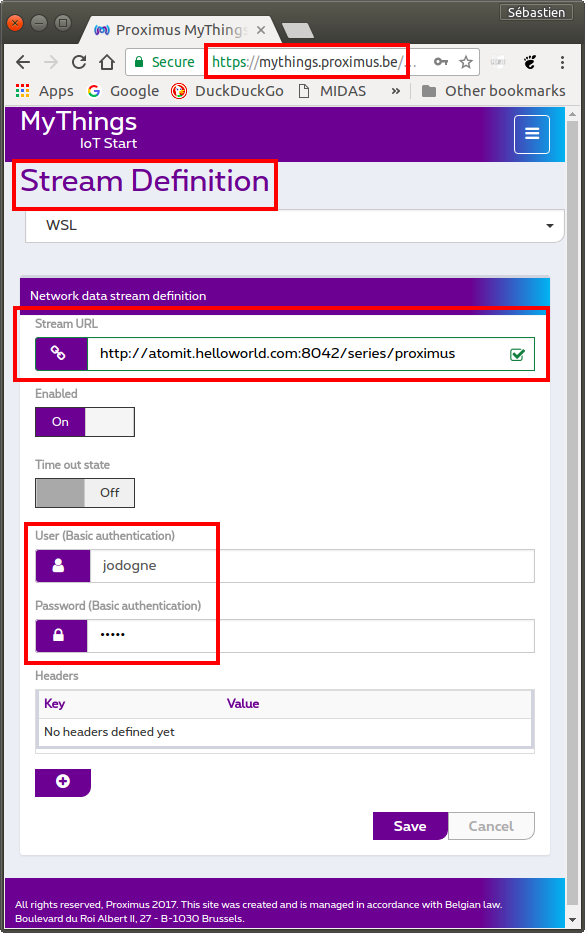

Connecting to Proximus MyThings
===============================

[Proximus MyThings](https://www.proximus.be/en/id_cl_iot/) is a
professional IoT network based upon
[LoRaWAN](https://en.wikipedia.org/wiki/LPWAN#LoRaWAN) and available
in Belgium.

The Atom-IT server can easily be integrated with Proximus MyThings
through so-called **Streams**, which are essentially callbacks that
send HTTP POST requests to some Web server whenever data is emitted by
one LoRa device (aka. a "Thing"). The process consists in deploying
the Atom-IT server on a server reacheable with a public IP address,
then in defining a Proximus MyThings Stream whose callback URL refers
to the [REST API](RestApi.md) of the Atom-IT server.


Configuring the Atom-IT server
------------------------------

The first things is obviously to start an Atom-IT on a server with a
public IP address (e.g. running on a
[VPS server](https://en.wikipedia.org/wiki/Virtual_private_server)).
Let's consider the following [configuration file](Configuration.md):

```
{
    "TimeSeries" : {
        "proximus" : { }   // Use the default memory backend
    },
    "RemoteAccessAllowed" : true,    // Allow HTTP POST from the Internet
    "AuthenticationEnabled" : true,  // Enable HTTP Basic Authentication
    "RegisteredUsers" : {            // List the HTTP users
        "jodogne" : "helloworld"
    }
}
```

This configuration defines a time series dedicated to storing packets
originating from Proximus MyThings. It also enables an HTTP user with
password to reject unauthorized accesses.

Pay attention to put the Atom-IT server behind a
[reverse proxy](https://en.wikipedia.org/wiki/Reverse_proxy), such as
Apache or nginx, in order to add HTTPS encryption. Ideally, for
security reasons, your reverse proxy should also block all the HTTP
requests that are not POST or that do not point to the
`/series/proximus/` URI.


Defining the Proximus MyThings Stream
-------------------------------------

Once your Atom-IT server is up and running, open the Proximus MyThings
administrative interface, and define the Stream associated to your
account as follows:



Note how the **Stream URL** parameter is set to point to the
[REST endpoint](RestApi.md) corresponding to the time series called
`proximus` that has been defined in the Atom-IT configuration file.
Obviously, adapt the credentials to those defined in your
configuration file.

Once you start the Atom-IT server with the `--verbose` command-line
argument, you can watch the messages arriving from Proximus MyThings
in the log:

```
$ ./AtomIT Configuration.json --verbose
[...]
W1218 11:07:32.753767 main.cpp:153] HTTP server listening on port: 8042
I1218 11:07:53.376360 MongooseServer.cpp:755] POST /series/proximus
I1218 11:07:53.376482 AtomITRestApi.cpp:219] Message appended through REST API to time series "proximus": "<?xml version="1.0" encoding="UTF-8"?><DevEUI_uplink xmlns="http://uri.actility.com/lora">[...]</DevEUI_uplink>"
```


Parsing the Proximus MyThings payload
-------------------------------------

As shown in the log, the body of the HTTP POST requests issued by the
Proximus MyThings Stream consists of a
[XML string](https://en.wikipedia.org/wiki/XML) similar to:

```
<?xml version="1.0" encoding="UTF-8"?>
<DevEUI_uplink xmlns="http://uri.actility.com/lora">
  <Time>2017-12-05T14:03:52.725+01:00</Time>
  <DevEUI>0004A30BAAAAAAAA</DevEUI>
  <FPort>1</FPort>
  <FCntUp>4</FCntUp>
  <MType>2</MType>
  <FCntDn>4</FCntDn>
  <payload_hex>f900</payload_hex>
  <mic_hex>c7ca4a73</mic_hex>
  <Lrcid>00000201</Lrcid>
  <LrrRSSI>-102.000000</LrrRSSI>
  <LrrSNR>-11.000000</LrrSNR>
  <SpFact>12</SpFact>
  <SubBand>G0</SubBand>
  <Channel>LC1</Channel>
  <DevLrrCnt>8</DevLrrCnt>
  <Lrrid>FF010D8A</Lrrid>
  <Late>0</Late>
  <LrrLAT>50.588387</LrrLAT>
  <LrrLON>5.555492</LrrLON>
  <Lrrs>
    <Lrr>
      <Lrrid>FF010CC6</Lrrid>
      <Chain>0</Chain>
      <LrrRSSI>-114.000000</LrrRSSI>
      <LrrSNR>-9.000000</LrrSNR>
      <LrrESP>-123.514969</LrrESP>
    </Lrr>
  </Lrrs>
  <CustomerID>100002662</CustomerID>
  <CustomerData>{"alr":{"pro":"MC/RN2483","ver":"1"}}</CustomerData>
  <ModelCfg>0</ModelCfg>
  <InstantPER>0.200000</InstantPER>
  <MeanPER>0.036917</MeanPER>
  <DevAddr>061019F7</DevAddr>
</DevEUI_uplink>
```

The actual data originally emitted by the hardware is a
hexadecimal-encoded string stored in the `payload_hex` field of this
XML payload.

This payload can be directly decoded within the Atom-IT
server. Indeed, the Atom-IT server embeds the
[Lua scripting engine](https://en.wikipedia.org/wiki/Lua_(programming_language)),
which can be used to apply a transcoding script to each message added
to some time series, storing the resulting message into another time
series. Here is a sample Lua script that will extract the actual data:

```
function Convert(timestamp, metadata, rawValue)
  local xml = ParseXml(rawValue, true)
  local payload = ParseHexadecimal(xml['payload_hex'])
  local device = xml['DevEUI']

  local result = {}
  result['metadata'] = device
  result['value'] = payload

  return result
end
```


Final configuration
-------------------

Once saved as file `Proximus.lua`, the Lua parser above can be
loaded into the Atom-IT server using the following configuration:

```
{
    "TimeSeries" : {
        "proximus" : { },
        "decoded" : {
            "Backend" : "SQLite",   // Store decoded time series as a SQLite database
            "Path" : "proximus.db"
        }
    },
    "Filters" : [
        {
            "Type" : "Lua",
            "Path" : "Proximus.lua",  // Path to the Lua script
            "Input" : "proximus",
            "Output" : "decoded"      // Output time series for decoded data
        }
    ],
    "RemoteAccessAllowed" : true,     // Allow HTTP POST from the Internet
    "AuthenticationEnabled" : true,   // Enable HTTP Basic Authentication
    "RegisteredUsers" : {             // List the HTTP users
        "jodogne" : "helloworld"
    }
}
```

This configuration file will write the decoded messages into a second
time series called `decoded`, that can be used by other filters or
external applications. As a consequence, the content of the resulting
time series (called `decoded`) is readily available using the
[REST API](RestApi.md) of the Atom-IT server:

```
$ curl -u 'jodogne:helloworld' http://atomit.helloworld.com:8042/series/decoded/content
{
   "content" : [
      {
         "base64" : true,
         "metadata" : "0004A30BAAAAAAAA",
         "timestamp" : 0,
         "value" : "+QA="
      }
   ],
   "done" : true,
   "name" : "decoded"
}
```

One can easily check that the
[Base64-encoded](https://en.wikipedia.org/wiki/Base64) string `+QA=`
returned by the Atom-IT server corresponds to the original `0xf900`
content of the `payload_hex` field in the Proximus MyThings Stream:

```
$ echo -n '+QA=' | base64 -d | hexdump -C
```
