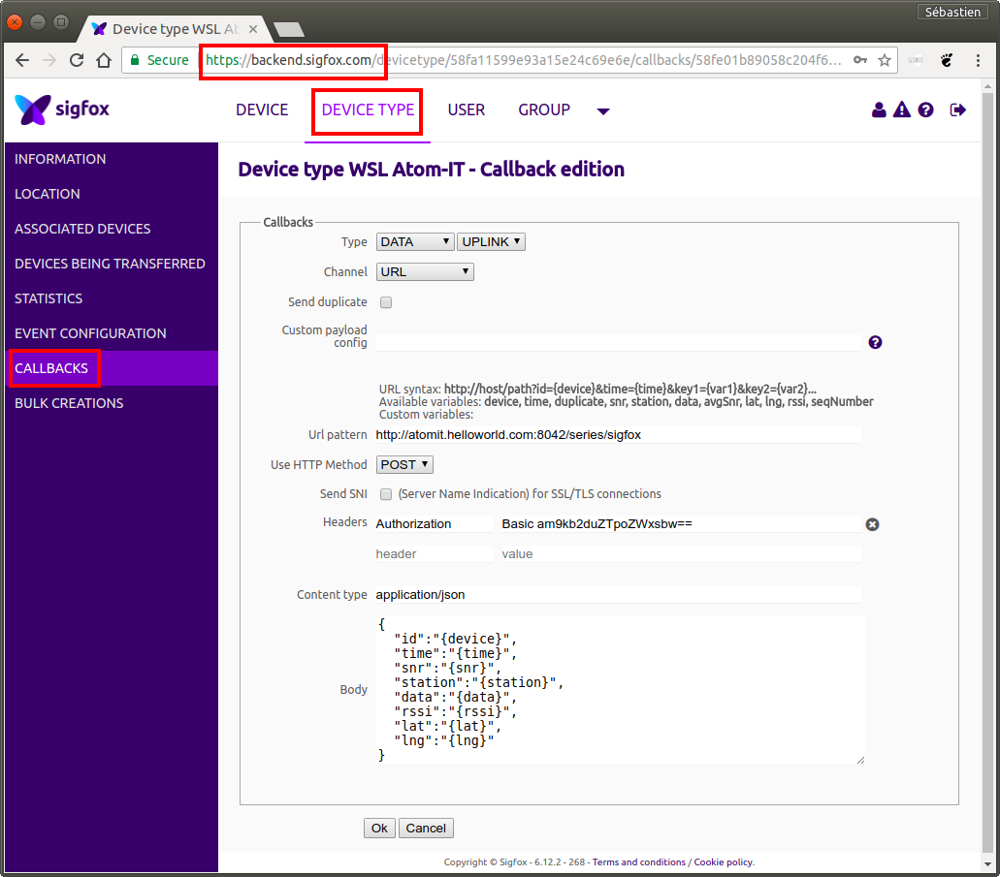

Connecting to Sigfox
====================

[Sigfox](https://en.wikipedia.org/wiki/Sigfox) is a professional,
international IoT infrastructure. It is officially operated in Belgium
by [Engie M2M](http://www.engiem2m.be/en).

The Atom-IT server can easily be integrated with Sigfox through
callbacks that send HTTP POST requests to some Web server whenever
data is emitted by one Sigfox device. The process consists in
deploying the Atom-IT server on a server reachable with a public IP
address, then in defining a Sigfox callback whose URL refers to the
[REST API](RestApi.md) of the Atom-IT server.


Configuring the Atom-IT server
------------------------------

The first things is obviously to start an Atom-IT on a server with a
public IP address (e.g. running on a
[VPS server](https://en.wikipedia.org/wiki/Virtual_private_server)).
Let's consider the following [configuration file](Configuration.md):

```
{
    "TimeSeries" : {
        "sigfox" : { }   // Use the default memory backend
    },
    "RemoteAccessAllowed" : true,    // Allow HTTP POST from the Internet
    "AuthenticationEnabled" : true,  // Enable HTTP Basic Authentication
    "RegisteredUsers" : {            // List the HTTP users
        "jodogne" : "hello"
    }
}
```

This configuration defines a time series dedicated to storing packets
originating from the Sigfox backend. It also enables an HTTP user with
password to reject unauthorized accesses.

Pay attention to put the Atom-IT server behind a
[reverse proxy](https://en.wikipedia.org/wiki/Reverse_proxy), such as
Apache or nginx, in order to add HTTPS encryption. Ideally, for
security reasons, your reverse proxy should also block all the HTTP
requests that are not POST or that do not point to the
`/series/sigfox/` URI.


Defining the Sigfox callback
----------------------------

Once your Atom-IT server is up and running, open the Sigfox backend
interface, open the "Device Type" tab, open the "Callbacks" menu, and
define the callback associated to your device type as follows:



A few explanations:

 * Adapt the "Url pattern" field to point to the
   [REST endpoint](RestApi.md) corresponding to the time series called
   `sigfox` that has been defined in the Atom-IT configuration file.
 * Make sure HTTP method is set to `POST`.
 * The
   [HTTP Basic authentication](https://en.wikipedia.org/wiki/Basic_access_authentication)
   credentials must be defined manually in the "Headers" field. Since
   our Atom-IT configuration file uses the `jodogne` username and the
   `hello` password, here is a command-line to generate the proper
   value for the "Authorization" HTTP header under Linux:
   
   ```
   # echo -n 'jodogne:hello' | base64
   ```
   
 * The body of the HTTP callback is set to a
   [JSON](https://en.wikipedia.org/wiki/JSON) content, with the following
   pattern (that can obviously be adapted to reflect your needs):
   
   ```
   {
     "id":"{device}",
     "time":"{time}",
     "snr":"{snr}",
     "station":"{station}",
     "data":"{data}",
     "rssi":"{rssi}",
     "lat":"{lat}",
     "lng":"{lng}"
   }
   ```

Once you start the Atom-IT server with the `--verbose` command-line
argument, you can watch the messages arriving from Sigfox in the log:

```
$ ./AtomIT Configuration.json --verbose
[...]
W1218 12:18:59.014418 main.cpp:153] HTTP server listening on port: 8042
I1218 12:19:13.839491 MongooseServer.cpp:755] POST /series/sigfox
I1218 12:19:13.839645 AtomITRestApi.cpp:219] Message appended through REST API to time series "sigfox": "(binary)"
```

Parsing the Sigfox payload
-------------------------------------

As a consequence of the configuration of our Sigfox callback, the body
of the HTTP POST requests issued by the Sigfox backend consists of a
[JSON string](https://en.wikipedia.org/wiki/JSON). This can be
verified by retrieving the raw body of the just-received message
through the [REST API](RestApi.md) of the Atom-IT server:

```
$ curl -u 'jodogne:hello' http://atomit.helloworld.com:8042/series/sigfox/content/0
{
  "id":"1CC532",
  "time":"1513595952",
  "snr":"32.11",
  "station":"106E",
  "data":"48656c6c70",
  "rssi":"-119.00",
  "lat":"51.0",
  "lng":"6.0"
}
```

The actual data originally emitted by the hardware is a
hexadecimal-encoded string stored in the `data` field of this JSON
payload. Original data (in our case, the `Hellp` string) can be
retrieved as follows:

```
$ echo -n '48656c6c70' | xxd -r -p
Hellp
```

This payload can be directly decoded within the Atom-IT
server. Indeed, the Atom-IT server embeds the
[Lua scripting engine](https://en.wikipedia.org/wiki/Lua_(programming_language)),
which can be used to apply a transcoding script to each message added
to some time series, storing the resulting message into another time
series. Here is a sample Lua script that will extract the actual data:

```
function Convert(timestamp, metadata, rawValue)
  local json = ParseJson(rawValue)
  local payload = ParseHexadecimal(json['data'])
  local device = json['id']

  local result = {}
  result['metadata'] = device
  result['value'] = payload

  return result
end
```


Final configuration
-------------------

Once saved as file `Sigfox.lua`, the Lua parser above can be
loaded into the Atom-IT server using the following configuration:

```
{
    "TimeSeries" : {
        "sigfox" : { },
        "decoded" : {
            "Backend" : "SQLite",    // Store decoded time series as a SQLite database
            "Path" : "sigfox.db"
        }
    },
    "Filters" : [
        {
            "Type" : "Lua",
            "Path" : "Sigfox.lua",   // Path to the Lua script
            "Input" : "sigfox",
            "Output" : "decoded"     // Output time series for decoded data
        }
    ],
    "RemoteAccessAllowed" : true,    // Allow HTTP POST from the Internet
    "AuthenticationEnabled" : true,  // Enable HTTP Basic Authentication
    "RegisteredUsers" : {            // List the HTTP users
        "jodogne" : "hello"
    }
}
```

This configuration file will write the decoded messages into a second
time series called `decoded`, that can be used by other filters or
external applications. As a consequence, the content of the resulting
time series (called `decoded`) is readily available using the
[REST API](RestApi.md) of the Atom-IT server:

```
$ curl -u 'jodogne:hello' http://atomit.helloworld.com:8042/series/decoded/content/
{
   "content" : [
      {
         "base64" : false,
         "metadata" : "1CC532",
         "timestamp" : 0,
         "value" : "Hellp"
      }
   ],
   "done" : true,
   "name" : "decoded"
}
```

As can be seen from the command-line above, the `Hellp` payload is
correctly decoded.
