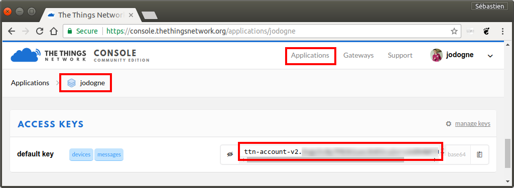

Connecting to The Things Network
================================

[The Things Network](https://www.thethingsnetwork.org/) self-describes
itself as *"a fully distributed Internet of Things data
infrastructure."* It is a global
[LoRaWAN](https://en.wikipedia.org/wiki/LPWAN#LoRaWAN) network, that
is based upon an open-source and open-hardware approach. Users can
register their own IoT hardware devices, then retrieve the packets
generated by these devices through the
[MQTT network protocol](https://en.wikipedia.org/wiki/MQTT). Retrieving
packets using MQTT consists in subscribing to a so-called **MQTT
broker**, which will awake the client application whenever a new
packet is generated by some of its associated devices.

The Atom-IT server comes with native support for the MQTT protocol.
This feature allows a seamless integration of the Atom-IT server with
[The Things Network broker](https://www.thethingsnetwork.org/docs/applications/mqtt/). This
page explains how to setup a simple IoT workflow that collects packets
from The Things Network, then stores these packets as time series in
the Atom-IT server. Once the time series are stored by the Atom-IT
server, they can easily be exploited using the [REST API](RestApi.md).


Retrieving the access keys
--------------------------

You first have to retrieve the access keys to your The Things Network
application. These personal keys are available at the bottom of the
"Overview" pane of your application:



The address of the European MQTT broker of The Things Network is
`eu.thethings.network` with default TCP port 1883. Depending on your
country, you might have to
[adapt this address](https://www.thethingsnetwork.org/docs/network/cli/quick-start.html#receiving-uplink-messages).


MQTT source filter
------------------

Once the access keys are retrieved, the following
[configuration file](Configuration.md) will connect to the MQTT broker
of The Things Network, and will store the received events into a time
series called `source`:

```javascript
{
  "TimeSeries" : {
    "source" : { }   // Use the default memory backend
  },
  "Filters" : [
    {
      "Type" : "MQTTSource",
      "Name" : "ttn",
      "Output" : "source",
      "Broker" : {
        "Server" : "eu.thethings.network",
        "Username" : "jodogne",             // Replace with your username
        "Password" : "ttn-account-v2.XXX"   // Replace with your access key
      },
      "Topics" : [
        "+/devices/+/up"
      ]
    }
  ]
}
```

The `Topics` subsection specifies a list of wildcards defining the
MQTT events the Atom-IT server will listen to (the `+` character
matches any string). In the context of The Things Network, whenever a
device registered as `arduino` generates a message for an application
called `jodogne`, the MQTT broker will emit an event called
`jodogne/device/arduino/up`. The payload of this event contains the
actual message.

Once you start the Atom-IT server with this sample configuration, it
will receive all the messages emitted by your device. Start the server
with the `--verbose` command-line argument to watch the messages
arriving in the log:

```
$ ./AtomIT Configuration.json --verbose
[...]
W1215 19:18:50.588808 SynchronousClient.cpp:333] Connected to MQTT broker eu.thethings.network
I1215 19:19:06.047025 SourceFilter.cpp:110] Message received by filter ttn: "{"app_id":"jodogne","dev_id":"jodogne","hardware_serial":"0004A30B001B06EC","port":1,"counter":0,"payload_raw":"uw==","metadata":{"time":"2017-12-15T18:19:06.095834104Z"}}" (metadata "jodogne/devices/jodogne/up")
```

The content of the collected time series can obviously be accessed
using the [REST API](RestApi.md) or the Web interface running at http://localhost:8042/


Decoding the payload
--------------------

As shown in the log, the payload of events generated by The Things
Network broker consists of a
[JSON string](https://en.wikipedia.org/wiki/JSON). The actual data
emitted by the hardware is a
[Base64-encoded string](https://en.wikipedia.org/wiki/Base64) stored
in the `payload_raw` field of the JSON payload.

This payload can be directly decoded within the Atom-IT
server. Indeed, the Atom-IT server embeds the
[Lua scripting engine](https://en.wikipedia.org/wiki/Lua_(programming_language)),
which can be used to apply a transcoding script to each message added
to some time series, storing the resulting message into another time
series. Here is a sample Lua script that will extract the actual data:

```lua
function Convert(timestamp, metadata, rawValue)
  -- Decode the JSON string as a Lua table structure
  local value = ParseJson(rawValue)

  -- Decode the Base-64 payload field
  local payload = DecodeBase64(value['payload_raw'])

  -- Get the device EUI
  local device = value['hardware_serial']
  
  -- Output a new message, whose value contains the binary
  -- data and whose metadata contains the device EUI
  local result = {}
  result['metadata'] = device
  result['value'] = payload
  return result
end
```

Once saved as file `Configuration.lua`, this Lua script can be loaded
into the Atom-IT server using the following configuration:

```javascript
{
  "TimeSeries" : {
    "source" : {
      "Backend" : "Memory",
      "Timestamp" : "MillisecondsClock"  // Label messages using system clock
    },
    "decoded" : {
      "Backend" : "SQLite",    // Store decoded time series as a SQLite database
      "Path" : "ttn.db"
    }
  },
  "Filters" : [
    {
      "Type" : "MQTTSource",
      "Name" : "ttn",
      "Output" : "source",
      "Broker" : {
        "Server" : "eu.thethings.network",
        "Username" : "jodogne",             // Replace with your username
        "Password" : "ttn-account-v2.XXX"   // Replace with your access key
      },
      "Topics" : [
        "+/devices/+/up"
      ]
    },
    {
      "Type" : "Lua",
      "Path" : "Configuration.lua",
      "Input" : "source",            // Time series from the MQTTSource filter
      "Output" : "decoded"           // Output time series for decoded data
    }
  ]
}
```

This configuration file will write the decoded messages into a second
time series called `decoded`, that can be used by other filters or
external applications. This completes this sample.
